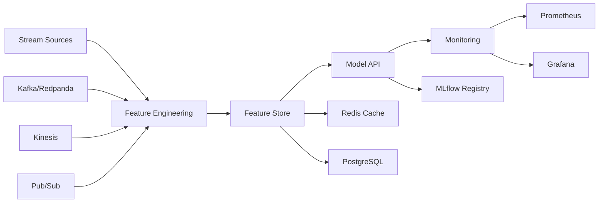

# Real-Time ML Pipeline Platform

Production-ready machine learning platform for real-time streaming data processing, model management, and high-performance API serving.

## Architecture



## Features

### Implemented
- **Multi-cloud streaming**: Kafka, AWS Kinesis, and GCP Pub/Sub consumers with async processing
- **Feature engineering**: Apache Beam pipelines for batch and streaming transformations
- **Feature store**: Redis caching with PostgreSQL persistence, batch operations support
- **Model serving**: FastAPI with automatic model updates, caching, and batch predictions
- **MLflow integration**: Model versioning, registry, and experiment tracking
- **Monitoring**: Prometheus metrics, Grafana dashboards, health checks

### Architecture Components
- Fully async/await FastAPI implementation with model caching
- Stream ingestion with proper acknowledgment and error handling
- Feature transformations with standardized interfaces
- Comprehensive metrics collection and alerting system

## Quick Start

### Prerequisites
- Docker & Docker Compose
- Python 3.11+
- 8GB RAM

### Local Development

```bash
# Clone repository
git clone <repository-url>
cd rt-ml-multicloud-platform

# Setup environment
cp .env.example .env
docker-compose up -d

# Run demo (trains model and tests API)
./scripts/demo/demo.sh

# Check services
curl http://localhost:8000/health  # API health
curl http://localhost:5000         # MLflow UI
```

### Service URLs
- API: http://localhost:8000
- API Docs: http://localhost:8000/docs
- MLflow: http://localhost:5000
- Grafana: http://localhost:3001 (admin/admin123)
- MinIO: http://localhost:9001 (minioadmin/minioadmin123)
- Prometheus: http://localhost:9090

## API Usage

### Single Prediction
```bash
curl -X POST http://localhost:8000/predict \
  -H "Content-Type: application/json" \
  -d '{
    "features": {
      "amount": 250.00,
      "merchant_category": "electronics",
      "hour_of_day": 14,
      "is_weekend": false,
      "risk_score": 0.3
    },
    "model_name": "fraud_detector",
    "return_probabilities": true
  }'
```

### Batch Prediction
```bash
curl -X POST http://localhost:8000/predict/batch \
  -H "Content-Type: application/json" \
  -d '{
    "instances": [
      {"amount": 100.0, "merchant_category": "grocery"},
      {"amount": 500.0, "merchant_category": "electronics"}
    ],
    "model_name": "fraud_detector"
  }'
```

## Project Structure

```
rt-ml-multicloud-platform/
├── src/
│   ├── ingestion/          # Stream consumers (Kafka, Kinesis, Pub/Sub)
│   ├── feature_engineering/# Apache Beam pipelines
│   ├── models/             # Model training utilities
│   ├── api/                # FastAPI application
│   ├── feature_store/      # Redis + PostgreSQL storage
│   ├── monitoring/         # Metrics and health checks
│   └── database/           # SQLAlchemy models
├── tests/                  # Unit and integration tests
├── docker/                 # Docker configurations
├── scripts/                # Utility scripts
├── configs/                # Environment configurations
├── monitoring/             # Prometheus and Grafana configs
└── docs/                   # Documentation
```

## Configuration

### Environment Variables

Create `.env` from `.env.example`:

```bash
# Core
ENVIRONMENT=development
DEBUG=true

# Database
DATABASE_HOST=localhost
DATABASE_PORT=5432
DATABASE_NAME=ml_pipeline
DATABASE_USER=postgres
DATABASE_PASSWORD=postgres

# Redis
REDIS_HOST=localhost
REDIS_PORT=6379

# MLflow
MLFLOW_TRACKING_URI=http://localhost:5000
MLFLOW_EXPERIMENT_NAME=fraud_detection

# API
API_HOST=0.0.0.0
API_PORT=8000
API_WORKERS=4
```

### Python Dependencies

The project uses Poetry for dependency management:

```bash
# Install Poetry
pip install poetry

# Install dependencies
poetry install

# Activate environment
poetry shell
```

Note: Some heavy dependencies (TensorFlow, PyTorch, XGBoost) are commented out in `pyproject.toml` for faster setup. Uncomment as needed.

## Testing

```bash
# Run all tests
poetry run pytest

# With coverage
poetry run pytest --cov=src --cov-report=html

# Specific test categories
poetry run pytest tests/unit/
poetry run pytest tests/integration/
```

## Deployment

### Docker Compose

Local development:
```bash
docker-compose up -d
```

Production with Kafka and scaling:
```bash
docker-compose -f docker-compose.yml -f docker-compose.prod.yml up -d
```

### Kubernetes

```bash
kubectl apply -f k8s/base/
kubectl apply -f k8s/overlays/production/
```

## Performance

Typical metrics on standard hardware:
- Prediction latency: P95 < 100ms
- Throughput: > 1000 RPS
- Feature store latency: < 10ms
- Model load time: < 30s

## Development

### Code Quality
```bash
# Format code
poetry run black src/ tests/
poetry run ruff check src/ tests/

# Type checking
poetry run mypy src/
```

### Contributing
- Follow conventional commits (feat:, fix:, chore:)
- Include tests for new features
- Update documentation as needed

## License

MIT License - see [LICENSE](LICENSE) file for details.