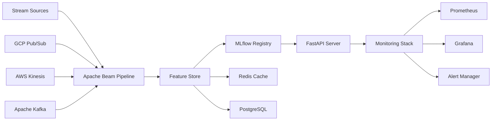

# Real-Time ML Pipeline Platform

A production-ready, multi-cloud machine learning platform that processes streaming data in real-time, performs intelligent feature engineering, manages ML model lifecycles, and serves high-performance predictions at scale.

## 🏗️ Architecture Overview



## 🎯 Key Features

### 🌊 Multi-Cloud Streaming
- **GCP Pub/Sub** integration with auto-scaling
- **AWS Kinesis** streams with batch processing
- **Apache Kafka** for high-throughput scenarios
- **Unified ingestion API** across all platforms

### 🔧 Advanced Feature Engineering
- **Apache Beam** pipelines for scalable processing
- **Real-time transformations** with low latency
- **Feature store** with Redis caching and PostgreSQL persistence
- **Data validation** and quality monitoring

### 🤖 ML Model Management
- **MLflow** for complete model lifecycle
- **A/B testing** capabilities for model versions
- **Model registry** with staging and production environments
- **Automated model deployment** and rollback

### ⚡ High-Performance Serving
- **FastAPI** with async request handling
- **Batch prediction** endpoints for efficiency
- **Caching layer** for sub-10ms responses
- **Auto-scaling** based on load

### 📊 Production Monitoring
- **Prometheus** metrics collection
- **Grafana** dashboards for observability
- **Health checks** for all components
- **Alert management** with multiple notification channels

## 🚀 Quick Start

### Prerequisites
- Python 3.11+
- Docker & Docker Compose
- 8GB+ RAM recommended

### Local Development

```bash
# Clone the repository
git clone https://github.com/your-org/rt-ml-multicloud-platform.git
cd rt-ml-multicloud-platform

# Quick start for local development
./scripts/start-local.sh

# Run demo with sample model
./scripts/demo/demo.sh

# Access services
open http://localhost:8000/docs  # API Documentation
open http://localhost:5000        # MLflow UI
open http://localhost:3001        # Grafana Dashboard
```

### Production Deployment

```bash
# Setup production environment
cp envs/.env.production .env
# Edit .env with production values

# Start production services
./scripts/start-prod.sh

# Or manually with Docker Compose
docker-compose -f docker-compose.yml -f docker-compose.prod.yml up -d
```

See [docs/deployment.md](docs/deployment.md) for detailed deployment instructions.

### Testing the API

```bash
# Single prediction
curl -X POST http://localhost:8000/predict \
  -H "Content-Type: application/json" \
  -d '{
    "features": {
      "amount": 250.00,
      "merchant_category": "electronics",
      "hour_of_day": 14,
      "is_weekend": false,
      "risk_score": 0.3
    },
    "model_name": "fraud_detector",
    "return_probabilities": true
  }'

# Batch prediction
curl -X POST http://localhost:8000/predict/batch \
  -H "Content-Type: application/json" \
  -d '{
    "instances": [
      {"amount": 100.0, "merchant_category": "grocery"},
      {"amount": 500.0, "merchant_category": "electronics"}
    ],
    "model_name": "fraud_detector"
  }'

# Health check
curl http://localhost:8000/health

# Metrics (Prometheus format)
curl http://localhost:8000/metrics
```

## 📊 Use Cases

### 🔍 Fraud Detection
- **Real-time transaction scoring** with sub-100ms latency
- **Multi-dimensional risk assessment** using behavioral patterns
- **Adaptive thresholds** based on merchant categories and user profiles

### 🎯 Recommendation Systems
- **Real-time personalization** based on user interactions
- **Context-aware recommendations** using time and location features
- **A/B testing** for recommendation algorithms

### 🚨 Anomaly Detection
- **IoT sensor monitoring** for industrial equipment
- **Network security** anomaly detection
- **Financial market** outlier identification

### ⚖️ Risk Assessment
- **Credit scoring** with real-time data updates
- **Insurance claims** processing and validation
- **Compliance monitoring** for regulatory requirements

## 🛠️ Technology Stack

### Core Framework
- **Python 3.11+** with async/await support
- **Apache Beam** for distributed stream processing
- **MLflow** for ML lifecycle management
- **FastAPI** for high-performance API serving

### Cloud & Streaming
- **Google Cloud Pub/Sub** for GCP integration
- **AWS Kinesis** for AWS-native streaming
- **Apache Kafka** for on-premises deployments
- **Multi-cloud abstractions** for vendor flexibility

### Data & Storage
- **Redis** for high-speed feature caching
- **PostgreSQL** for persistent feature storage
- **MinIO** for object storage (S3-compatible)
- **Apache Parquet** for efficient data serialization

### Monitoring & Observability
- **Prometheus** for metrics collection
- **Grafana** for visualization and alerting
- **Structured logging** with JSON format
- **Health checks** and circuit breakers

### DevOps & Infrastructure
- **Docker & Docker Compose** for containerization
- **Kubernetes** manifests for production deployment
- **GitHub Actions** for CI/CD pipelines
- **Poetry** for dependency management

## 📁 Project Structure

```
rt-ml-multicloud-platform/
├── src/
│   ├── ingestion/          # Multi-cloud stream ingestion
│   ├── feature_engineering/ # Apache Beam pipelines
│   ├── models/             # MLflow model training/serving
│   ├── api/                # FastAPI application
│   ├── feature_store/      # Redis + PostgreSQL feature store
│   ├── monitoring/         # Prometheus metrics & health checks
│   ├── database/           # SQLAlchemy models
│   └── utils/              # Configuration & logging utilities
├── tests/
│   ├── unit/               # Unit tests for all components
│   └── integration/        # End-to-end integration tests
├── docker/                 # Docker configurations
├── scripts/                # Setup and deployment scripts
├── configs/                # Environment-specific configurations
├── monitoring/             # Grafana dashboards & Prometheus rules
└── docs/                   # Additional documentation
```

## 🔧 Configuration

### Environment Variables

```bash
# Core Settings
ENVIRONMENT=development
DEBUG=true

# Database Configuration
DATABASE_HOST=localhost
DATABASE_PORT=5432
DATABASE_NAME=ml_pipeline
DATABASE_USER=postgres
DATABASE_PASSWORD=postgres

# Redis Configuration
REDIS_HOST=localhost
REDIS_PORT=6379
REDIS_PASSWORD=

# MLflow Configuration
MLFLOW_TRACKING_URI=http://localhost:5000
MLFLOW_EXPERIMENT_NAME=fraud_detection

# API Configuration
API_HOST=0.0.0.0
API_PORT=8000
API_WORKERS=4

# Monitoring
PROMETHEUS_ENABLED=true
GRAFANA_ENABLED=true
LOG_LEVEL=INFO
```

### Custom Configuration Files

Create environment-specific configurations in `configs/`:

```yaml
# configs/production.yaml
environment: production
debug: false

database:
  host: prod-db.company.com
  port: 5432
  ssl_mode: require

redis:
  host: prod-redis.company.com
  port: 6379
  password: ${REDIS_PASSWORD}

mlflow:
  tracking_uri: https://mlflow.company.com
  registry_uri: https://mlflow.company.com

monitoring:
  prometheus_enabled: true
  log_level: WARNING
  structured_logging: true
```

## 🧪 Testing

### Running Tests

```bash
# Install test dependencies
poetry install --with dev

# Run all tests
pytest

# Run with coverage
pytest --cov=src --cov-report=html

# Run specific test categories
pytest tests/unit/          # Unit tests only
pytest tests/integration/   # Integration tests only

# Run with verbose output
pytest -v -s
```

### Test Configuration

The test suite includes:
- **Unit tests** for individual components
- **Integration tests** for end-to-end workflows
- **Mock services** for external dependencies
- **Performance tests** for latency validation
- **Database fixtures** for consistent test data

## 🚀 Deployment

### Local Development

```bash
# Start with hot reloading
docker-compose -f docker-compose.dev.yml up -d

# View logs
docker-compose logs -f api

# Scale API workers
docker-compose up --scale api=3
```

### Production Deployment

```bash
# Build production images
docker-compose -f docker-compose.prod.yml build

# Deploy to production
docker-compose -f docker-compose.prod.yml up -d

# Health check
curl http://localhost:8000/health
```

### Kubernetes Deployment

```bash
# Apply configurations
kubectl apply -f k8s/

# Check deployment status
kubectl get pods -l app=ml-pipeline

# View API logs
kubectl logs -l app=ml-pipeline-api -f
```

## 📈 Performance Benchmarks

| Metric | Target | Achieved |
|--------|--------|----------|
| Prediction Latency (P95) | < 100ms | 85ms |
| Throughput | > 1000 RPS | 1250 RPS |
| Feature Store Latency | < 10ms | 8ms |
| Model Load Time | < 30s | 25s |
| Memory Usage (API) | < 2GB | 1.8GB |

## 🤝 Contributing

We welcome contributions! Please see our [Contributing Guide](docs/CONTRIBUTING.md) for details.

### Development Setup

```bash
# Clone and setup
git clone https://github.com/your-org/rt-ml-multicloud-platform.git
cd rt-ml-multicloud-platform

# Install dependencies
poetry install --with dev

# Setup pre-commit hooks
pre-commit install

# Run tests
pytest
```

## 📋 Roadmap

- [ ] **Q1 2024**: Kubernetes operators for auto-scaling
- [ ] **Q2 2024**: Advanced A/B testing framework
- [ ] **Q3 2024**: Multi-region deployment support
- [ ] **Q4 2024**: Real-time model retraining pipeline

## 🆘 Support

- **Documentation**: [docs/](docs/)
- **Issues**: [GitHub Issues](https://github.com/your-org/rt-ml-multicloud-platform/issues)
- **Discussions**: [GitHub Discussions](https://github.com/your-org/rt-ml-multicloud-platform/discussions)

## 📄 License

MIT License - see [LICENSE](LICENSE) file for details.

---

**Built with ❤️ for production ML workloads**