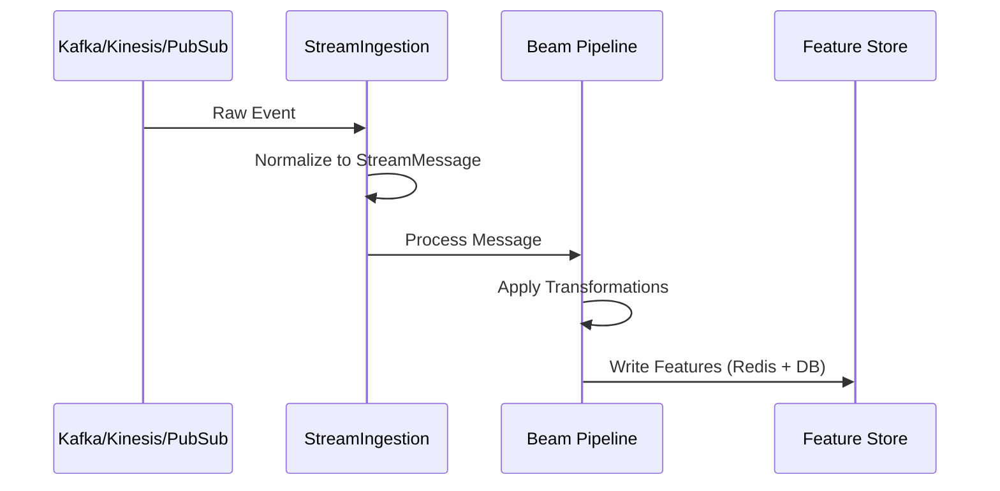
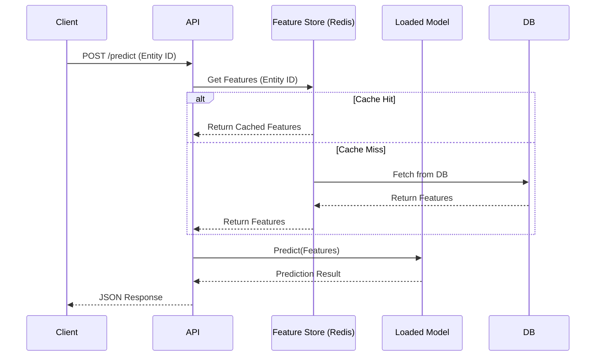
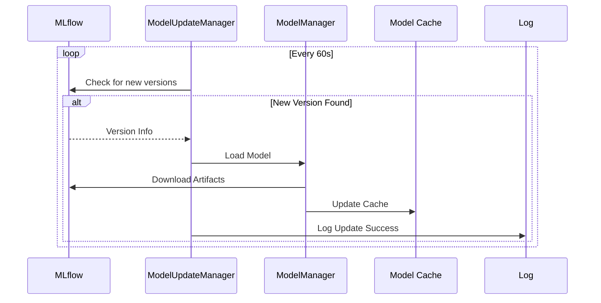

# Data Flow

This document describes how data moves through the system, from ingestion to prediction.

## 1. Ingestion Flow

Raw events are ingested from external sources.

## 2. Prediction Flow

The API handles prediction requests by fetching features and querying the model.

## 3. Model Update Flow

The system automatically updates models when new versions are available in MLflow.

