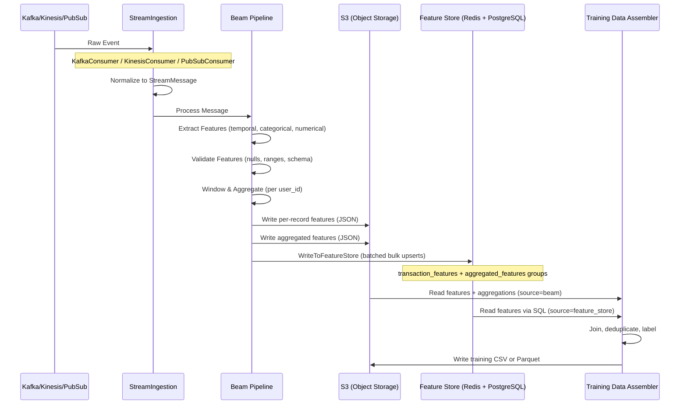
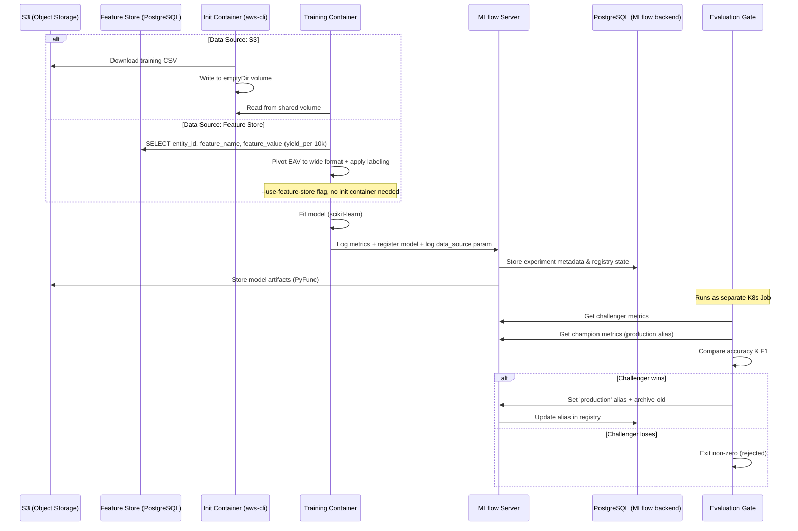
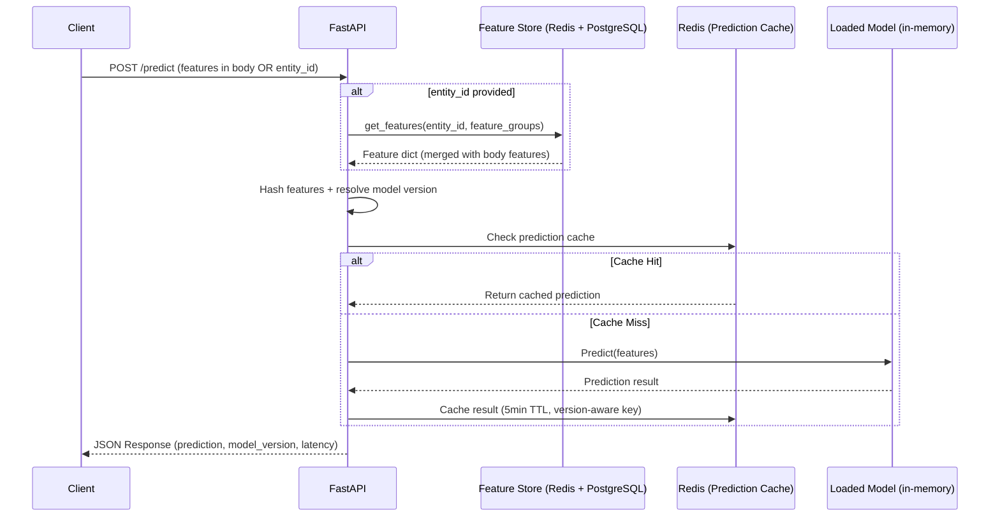
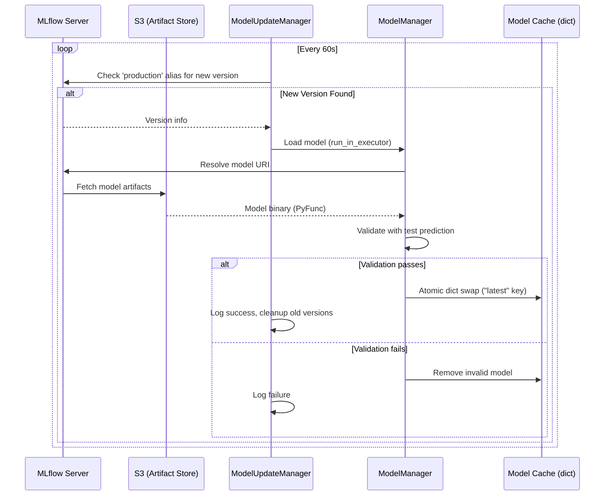

# Data Flow

This document describes how data moves through the system, from ingestion to prediction.

## 1. Ingestion & Feature Engineering Flow

Raw events are ingested from external sources, transformed by Beam, and written to S3 and/or the Feature Store.

```mermaid
sequenceDiagram
    participant Source as Kafka/Kinesis/PubSub
    participant Ingestion as StreamIngestion
    participant Beam as Beam Pipeline
    participant S3 as S3 (Object Storage)
    participant FS as Feature Store (Redis + PostgreSQL)
    participant Assembler as Training Data Assembler

    Source->>Ingestion: Raw Event
    Note over Ingestion: KafkaConsumer / KinesisConsumer / PubSubConsumer
    Ingestion->>Ingestion: Normalize to StreamMessage
    Ingestion->>Beam: Process Message
    Beam->>Beam: Extract Features (temporal, categorical, numerical)
    Beam->>Beam: Validate Features (nulls, ranges, schema)
    Beam->>Beam: Window & Aggregate (per user_id)
    Beam->>S3: Write per-record features (JSON)
    Beam->>S3: Write aggregated features (JSON)
    Beam->>FS: WriteToFeatureStore (batched bulk upserts)
    Note over FS: transaction_features + aggregated_features groups
    S3->>Assembler: Read features + aggregations (source=beam)
    FS->>Assembler: Read features via SQL (source=feature_store)
    Assembler->>Assembler: Join, deduplicate, label
    Assembler->>S3: Write training CSV or Parquet
```

### Output Modes

The Beam pipeline supports three output types via `output.type` in `pipeline_options.yaml`:

*   **`s3`** (default): Writes features and aggregations to S3 as JSON-lines.
*   **`feature_store`**: Writes directly to the Feature Store via `WriteToFeatureStore` DoFn with batched bulk upserts.
*   **`s3+feature_store`**: Dual-write to both S3 and the Feature Store for maximum flexibility.

## 2. Training & Promotion Flow

Training supports two data sources: S3 (CSV via init container) or the Feature Store (direct SQL query).

```mermaid
sequenceDiagram
    participant S3 as S3 (Object Storage)
    participant FS as Feature Store (PostgreSQL)
    participant Init as Init Container (aws-cli)
    participant Train as Training Container
    participant MLflow as MLflow Server
    participant Postgres as PostgreSQL (MLflow backend)
    participant Eval as Evaluation Gate

    alt Data Source: S3
        Init->>S3: Download training CSV
        Init->>Init: Write to emptyDir volume
        Train->>Init: Read from shared volume
    else Data Source: Feature Store
        Train->>FS: SELECT entity_id, feature_name, feature_value (yield_per 10k)
        Train->>Train: Pivot EAV to wide format + apply labeling
        Note over Train: --use-feature-store flag, no init container needed
    end
    Train->>Train: Fit model (scikit-learn)
    Train->>MLflow: Log metrics + register model + log data_source param
    MLflow->>Postgres: Store experiment metadata & registry state
    MLflow->>S3: Store model artifacts (PyFunc)
    Note over Eval: Runs as separate K8s Job
    Eval->>MLflow: Get challenger metrics
    Eval->>MLflow: Get champion metrics (production alias)
    Eval->>Eval: Compare accuracy & F1
    alt Challenger wins
        Eval->>MLflow: Set 'production' alias + archive old
        MLflow->>Postgres: Update alias in registry
    else Challenger loses
        Eval->>Eval: Exit non-zero (rejected)
    end
```

## 3. Prediction Flow

The API accepts features in the request body or fetches them from the Feature Store by `entity_id`.

```mermaid
sequenceDiagram
    participant Client
    participant API as FastAPI
    participant FS as Feature Store (Redis + PostgreSQL)
    participant Redis as Redis (Prediction Cache)
    participant Model as Loaded Model (in-memory)

    Client->>API: POST /predict (features in body OR entity_id)

    alt entity_id provided
        API->>FS: get_features(entity_id, feature_groups)
        FS-->>API: Feature dict (merged with body features)
    end

    API->>API: Hash features + resolve model version
    API->>Redis: Check prediction cache

    alt Cache Hit
        Redis-->>API: Return cached prediction
    else Cache Miss
        API->>Model: Predict(features)
        Model-->>API: Prediction result
        API->>Redis: Cache result (5min TTL, version-aware key)
    end

    API-->>Client: JSON Response (prediction, model_version, latency)
```

### Feature Store API Endpoints

*   `GET /features/groups` - List all feature groups with entity and feature counts.
*   `GET /features/stats/{feature_group}` - Statistics for a specific feature group.
*   `GET /features/{entity_id}` - Retrieve features for an entity (optional `?group=` filter).

## 4. Model Auto-Update Flow

The API automatically detects and loads new model versions from MLflow with zero downtime.

```mermaid
sequenceDiagram
    participant MLflow as MLflow Server
    participant S3 as S3 (Artifact Store)
    participant Updater as ModelUpdateManager
    participant Manager as ModelManager
    participant Cache as Model Cache (dict)

    loop Every 60s
        Updater->>MLflow: Check 'production' alias for new version

        alt New Version Found
            MLflow-->>Updater: Version info
            Updater->>Manager: Load model (run_in_executor)
            Manager->>MLflow: Resolve model URI
            MLflow->>S3: Fetch model artifacts
            S3-->>Manager: Model binary (PyFunc)
            Manager->>Manager: Validate with test prediction
            alt Validation passes
                Manager->>Cache: Atomic dict swap ("latest" key)
                Updater->>Updater: Log success, cleanup old versions
            else Validation fails
                Manager->>Cache: Remove invalid model
                Updater->>Updater: Log failure
            end
        end
    end
```
