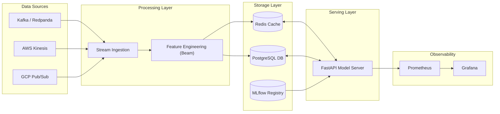

# Architecture Overview

The **Real-Time ML Multicloud Platform** is designed to provide a robust, scalable, and low-latency environment for serving machine learning models. It handles the entire lifecycle from data ingestion to model serving and monitoring.

## System Architecture

## Key Design Principles

1.  **Multi-Cloud Support**: The platform is agnostic to the underlying cloud provider for data ingestion (AWS, GCP, or generic Kafka).
2.  **Real-Time First**: Designed for low-latency predictions using a high-performance Feature Store backed by Redis.
3.  **Separation of Concerns**:
    *   **Ingestion**: Decoupled from processing to handle backpressure and different protocols.
    *   **Feature Store**: Centralized feature management to prevent training-serving skew.
    *   **Serving**: Async FastAPI server for high concurrency.
4.  **Observability**: Built-in metrics collection for every component.

## Data Flow

1.  **Ingestion**: Raw events are consumed from streaming sources (Kafka, Kinesis, Pub/Sub).
2.  **Transformation**: Apache Beam pipelines process raw events into features.
3.  **Storage**: Features are stored in the Feature Store (Redis for hot access, PostgreSQL for persistence).
4.  **Prediction**: The API receives a prediction request, fetches features from the Feature Store, and queries the loaded ML model.
5.  **Monitoring**: Latency, throughput, and model performance metrics are collected and visualized.
