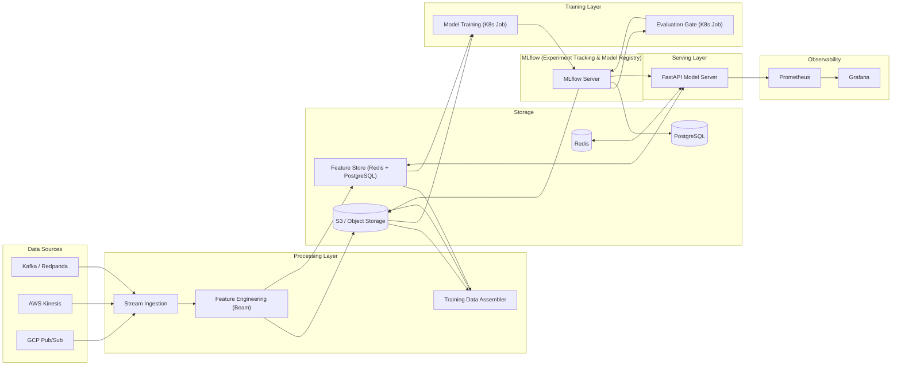

# Architecture Overview

The **Real-Time ML Multicloud Platform** is designed to provide a robust, scalable, and low-latency environment for serving machine learning models. It handles the entire lifecycle from data ingestion to model serving and monitoring.

## System Architecture

```mermaid
graph LR
    subgraph "Data Sources"
        Kafka["Kafka / Redpanda"]
        Kinesis["AWS Kinesis"]
        PubSub["GCP Pub/Sub"]
    end

    subgraph "Processing Layer"
        Ingestion["Stream Ingestion"]
        Beam["Feature Engineering (Beam)"]
        Assembler["Training Data Assembler"]
    end

    subgraph "Storage"
        S3[("S3 / Object Storage")]
        Postgres[("PostgreSQL")]
        Redis[("Redis")]
        FS["Feature Store (Redis + PostgreSQL)"]
    end

    subgraph "MLflow (Experiment Tracking & Model Registry)"
        MLflow["MLflow Server"]
    end

    subgraph "Training Layer"
        Training["Model Training (K8s Job)"]
        Evaluation["Evaluation Gate (K8s Job)"]
    end

    subgraph "Serving Layer"
        API["FastAPI Model Server"]
    end

    subgraph "Observability"
        Prometheus["Prometheus"]
        Grafana["Grafana"]
    end

    Kafka --> Ingestion
    Kinesis --> Ingestion
    PubSub --> Ingestion

    Ingestion --> Beam
    Beam --> S3
    Beam --> FS

    S3 --> Assembler
    FS --> Assembler
    Assembler --> S3

    S3 --> Training
    FS --> Training
    Training --> MLflow
    MLflow --> Evaluation
    Evaluation --> MLflow

    MLflow --> Postgres
    MLflow --> S3
    MLflow --> API
    Redis <--> API
    FS <--> API

    API --> Prometheus
    Prometheus --> Grafana
```

## Key Design Principles

1.  **Multi-Cloud Support**: The platform is agnostic to the underlying cloud provider for data ingestion (AWS, GCP, or generic Kafka).
2.  **Real-Time First**: Designed for low-latency predictions using Redis-backed prediction result caching and in-memory model serving.
3.  **Separation of Concerns**:
    *   **Ingestion**: Decoupled from processing to handle backpressure and different protocols.
    *   **Feature Engineering**: Apache Beam pipelines transform raw events into features, writing to object storage (S3).
    *   **Training**: K8s Jobs pull training data from S3, fit models, and log to MLflow.
    *   **Serving**: Async FastAPI server for high concurrency with automatic model updates.
4.  **Observability**: Built-in metrics collection for every component.

## Data Flow

1.  **Ingestion**: Raw events are consumed from streaming sources (Kafka, Kinesis, Pub/Sub) via pluggable adapters.
2.  **Transformation**: Apache Beam pipelines process raw events into features and write them to S3 and/or the Feature Store (configurable via `output.type`: `s3`, `feature_store`, or `s3+feature_store`).
3.  **Assembly**: A training data assembler supports two sources: S3 JSON-lines (`source=beam`) or Feature Store PostgreSQL (`source=feature_store`). Outputs training-ready CSV or Parquet.
4.  **Training**: K8s Jobs train models from S3 (via init container) or directly from the Feature Store (`--use-feature-store`). Models are registered in MLflow with `data_source` lineage tracking. MLflow stores experiment metadata in PostgreSQL and model artifacts in S3.
5.  **Evaluation**: A champion-challenger evaluation gate queries MLflow's model registry to compare the new model against the current production champion, promoting via the `production` alias if it passes.
6.  **Serving**: The API polls MLflow for production alias changes, downloads model artifacts via `mlflow.pyfunc.load_model`, and atomically swaps the in-memory reference. Predictions can use features from the request body or fetch them from the Feature Store by `entity_id`. Prediction results are cached in Redis (keyed by model version + feature hash).
7.  **Monitoring**: Latency, throughput, and model performance metrics are collected and visualized via Prometheus and Grafana.
